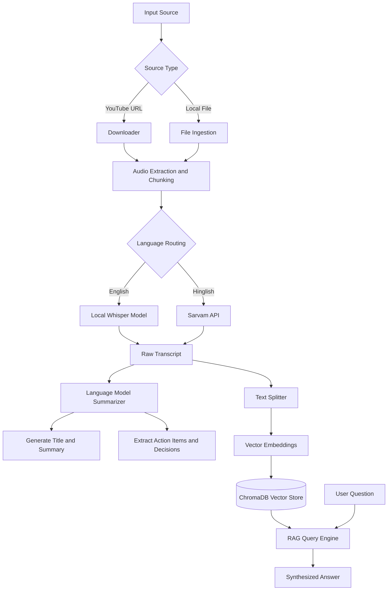

# AI Video Assistant

## Project Overview

The AI Video Assistant is a comprehensive, AI-driven backend pipeline designed to extract intelligence from video and audio meetings, lectures, or presentations. It seamlessly processes YouTube links and local media files, transcribing spoken words into text, summarizing complex discussions, extracting critical action items, and providing an interactive Question and Answer interface based on the transcript. 

By leveraging local and cloud-based AI models, the assistant automates the tedious process of manual note-taking and allows users to quickly query large amounts of spoken information using a Retrieval-Augmented Generation (RAG) architecture.

## High-Level Architecture and Flow Diagram

The system operates through a sequential pipeline, transforming raw audio into structured, searchable intelligence.



## Detailed Pipeline Execution

### 1. Ingestion and Audio Processing
The pipeline begins by accepting either a YouTube URL or a path to a local media file. If a YouTube link is provided, the system fetches the media automatically. The core audio processor utility then extracts the audio track and splits it into manageable chunks. This chunking ensures that memory usage remains efficient and allows API rate limits (such as those imposed by external transcription services) to be respected.

### 2. Transcription Engine
Once the audio is segmented, it is routed to the transcriber. The system supports multi-language strategies:
- **English Audio**: Routed to a local instance of the Whisper model. Running locally ensures data privacy and eliminates API costs.
- **Hinglish Audio**: Routed to the Sarvam API, which is specialized in understanding mixed Hindi-English speech and translating it seamlessly into English transcripts.

### 3. Intelligence Extraction
The raw transcript is passed to the core summarization and extraction modules. Utilizing prompt engineering and a Large Language Model, the system generates a concise summary of the entire conversation. Furthermore, it systematically parses the text to identify and extract:
- Action Items
- Key Decisions
- Open Questions

### 4. Retrieval-Augmented Generation (RAG)
To allow dynamic interaction with the video content, the transcript is processed by the vector store module. The text is split into smaller documents, embedded using sentence transformers, and stored in a local ChromaDB instance. When a user asks a question, the RAG engine retrieves the most relevant semantic chunks from the vector database and passes them to the LLM to construct a highly accurate, context-aware answer based exclusively on the provided video context.

## Setup and Installation

### Prerequisites
- Python 3.10 or higher
- FFmpeg installed and added to the system PATH

### Installation Steps
1. Clone the repository.
2. Create and activate a virtual environment.
3. Install the required dependencies:
   ```bash
   pip install -r Requirements.txt
   ```
4. Create a `.env` file in the root directory and configure your environment variables:
   ```env
   SARVAM_API_KEY=your_sarvam_api_key
   MISTRAL_API_KEY=your_mistral_api_key
   WHISPER_MODEL=base
   ```

## Usage

To start the processing pipeline, execute the main script from your terminal:

```bash
python main.py
```

You will be prompted to provide the media source (URL or file path) and select the primary language of the video. The script will output the summary and enter an interactive loop where you can ask questions about the content.
